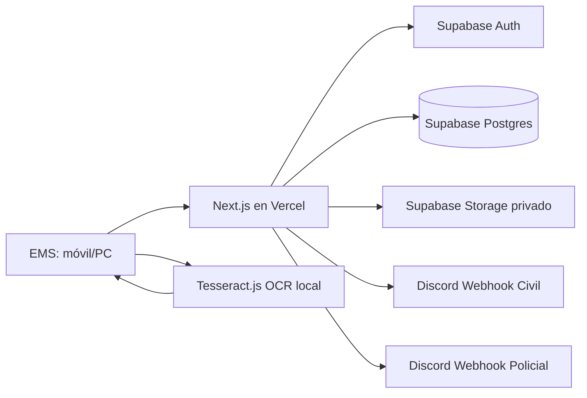
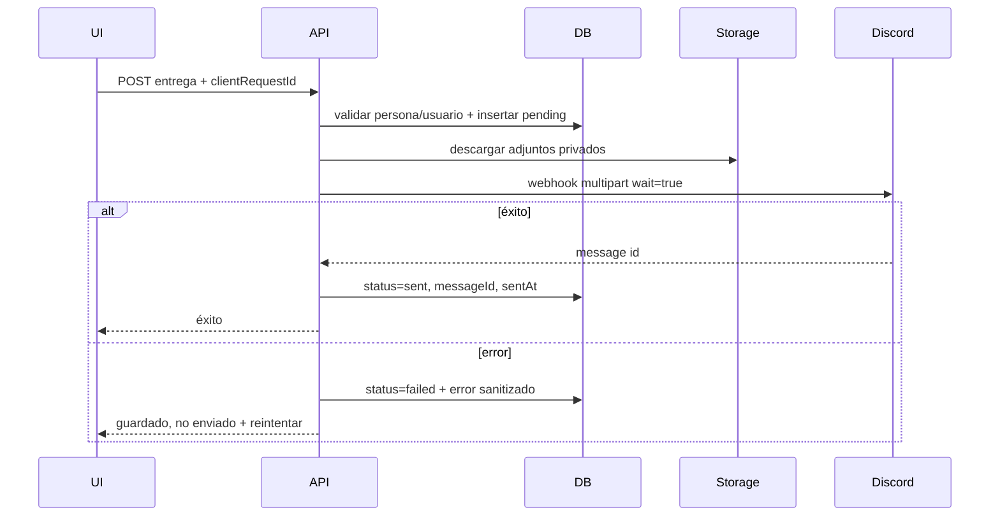

# 05 — Arquitectura

## Diagrama de alto nivel



## Separación cliente/servidor

### Cliente

Responsable de:

- UI.
- Cámara/subida de imagen.
- Compresión de imagen.
- OCR.
- Confirmación manual.
- Búsqueda interactiva mediante API.
- Mostrar progreso y errores.

Nunca debe contener:

- Secret key de Supabase.
- Webhooks Discord.
- Lógica que conceda permisos por sí sola.

### Servidor Next.js

Responsable de:

- Verificar sesión.
- Verificar `profile.active` y rol.
- CRUD autorizado.
- Crear URLs/tokens de subida si se usa subida directa.
- Procesar entregas.
- Descargar documentos privados para adjuntarlos a Discord.
- Enviar webhooks.
- Crear/desactivar/resetear usuarios.

### Supabase

Responsable de:

- Sesiones/password hashing (Auth).
- Persistencia relacional.
- Almacenamiento privado.

## Patrón de acceso a datos

Preferencia V1: **server-only data access**.

- Componentes cliente llaman Route Handlers/Server Actions.
- El servidor usa una sesión Supabase para identidad y un cliente servidor con secret/service role para operaciones autorizadas.
- El servidor siempre llama `requireActiveProfile()` antes de operaciones sensibles.
- Tablas del esquema público deben tener RLS habilitado y grants de anon/authenticated revocados si no se consumen directamente.

Esto reduce superficie de ataque y evita escribir políticas RLS complejas para cada interacción del navegador.

## Flujo de entrega robusto



## Idempotencia

Cada intento de crear una entrega recibe `clientRequestId` UUID generado una vez en el cliente.

- `deliveries.client_request_id` es UNIQUE.
- Si el mismo request se repite, devolver la entrega existente.
- Un `retry` de Discord opera sobre `deliveryId`; no inserta nueva entrega.

## Imágenes

Bucket privado único: `rp-documents`.

Rutas sugeridas:

```text
ine/{personId}/{uuid}.webp
badge/{personId}/{uuid}.webp
```

El usuario no recibe URLs permanentes públicas.
